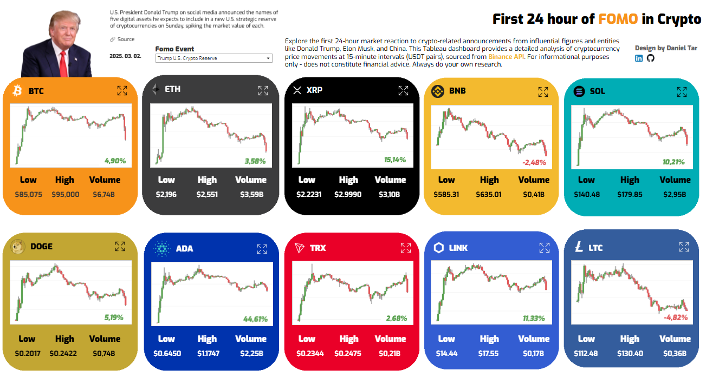
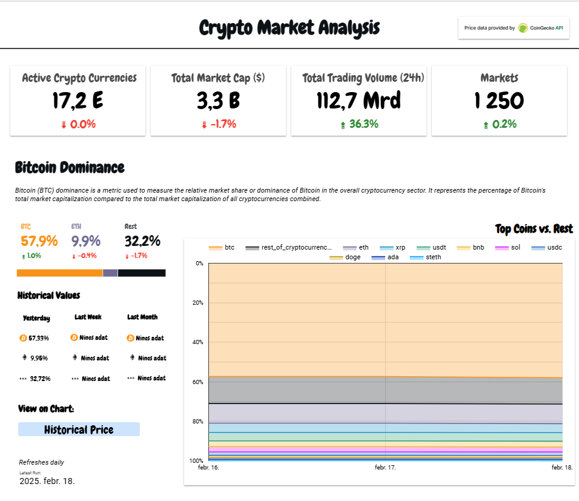
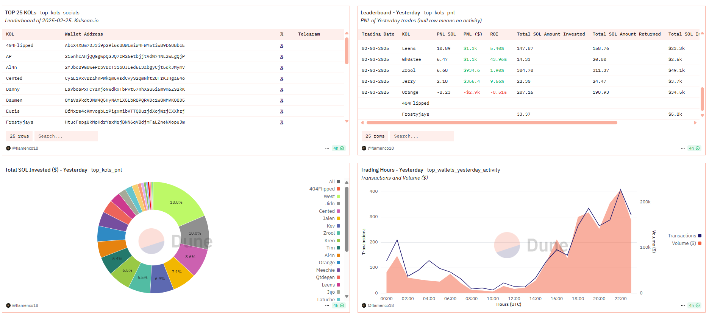

# 📊 BI Dashboards

Welcome to my **Business Intelligence & Data Visualization Portfolio**!  
Here, you'll find interactive dashboards created using **Looker Studio, Tableau, Power BI and Dune**, showcasing data-driven insights.

---
## Tableau

# 🔷 First 24 Hours of Crypto FOMO Dashboard 📊

This dashboard gives immediate insights into cryptocurrency market behaviors following major "Fear of Missing Out (FOMO)" events triggered by influential global figures and entities.

## 🚀 Key Features

- **📅 FOMO Event Selector**
  - Interactive selection of influential events affecting the cryptocurrency markets, including announcements from prominent political leaders, industry figures, and influential organizations.
- **📊 Top Cryptocurrencies Overview**
  - Detailed analysis featuring price charts for a 24-hour period, capturing market highs, lows, and trading volumes for the top cryptocurrencies.
- **⚙️ Real-Time Market Trends**
  - Visualizes immediate price reactions and historical trend data, clearly highlighting market changes due to specific events.
- **📈 Expanded Chart View**
  - Expand the chart to see the highlights of the FOMO event.

  

#### 🔑 **Tech Stack**

- **Tableau Public** (Data Visualization)  
- **Binance API** (klines, 15 min data)

🤖 [View the Apps Script JS File](./scripts/python_scripts/fomo_binance.py)  
🔗 [View Dashboard](https://public.tableau.com/views/First24HourofFOMOinCrypto/Dashboard?:language=en-US&publish=yes&:sid=&:redirect=auth&:display_count=n&:origin=viz_share_link)

## Power BI
[ IN PROGRESS ]

🔷  
🔗 [View Dashboard](https://app.powerbi.com/your-dashboard-link)  
📄

## Looker Studio

### 🔷 Crypto Market Analysis Dashboard 📊

This project showcases a **Crypto Market Analysis Dashboard** built using **Looker Studio** with live data retrieved from the **CoinGecko API**. The dashboard provides real-time insights into the global crypto market, top trending coins, and historical price trends for the **top 10 cryptocurrencies** and **trending coins**.

#### 🚀 **Key Features**

- 🌐 **Global Market Overview**: Track total market cap, active cryptocurrencies, and trading volume.  
- 📈 **Trending Coins Dashboard**: Highlights the 15 most popular coins based on user activity.  
- 📊 **Historical Price Chart**: Monitors historical price movements for top 10 and trending coins.  
- 🔄 **Automated Updates**: Data refreshes daily, hourly, or every 4 hours, depending on the dataset.  
- ⚙️ **API Integration**: Utilizes CoinGecko API endpoints like **global**, **trending**, and **coins/ohlc**.  

  

#### 🔑 **Tech Stack**

- **Looker Studio** (Data Visualization)  
- **Google Apps Script** (Data Fetching and Automation)  
- **CoinGecko API** (Live Crypto Data)

🤖 [View the Apps Script JS File](./scripts/apps_scripts/coingecko.js)  
🔗 [View Dashboard](https://lookerstudio.google.com/u/0/reporting/7df8f109-6f75-47ce-a48d-d4a8aa989d5d/page/sDkrE)

## Dune

### 🔷 Top Solana Memecoin Traders 📊

This project features a **Top Solana Memecoin Traders Dashboard** built using **Dune Analytics**. It tracks **Key Opinion Leaders (KOLs)** in the Solana memecoin ecosystem, providing insights into their trading activity, investments, and top-performing tokens.

*Static list of KOLs (leaderboard - on February 25, 2025)*

*https://kolscan.io/leaderboard*

#### 🚀 **Key Features**

- 📊 **Leaderboard & PnL Tracking**: Displays the top traders based on profits and returns.  
- 🔍 **KOL Wallet Analysis**: Identifies top wallets engaged in high-volume memecoin trading.  
- 💰 **Top Tokens & Pairs**: Highlights the most-traded and most-profitable memecoins.  
- ⏳ **Trading Hours Analysis**: Visualizes hourly transaction trends and volume spikes.  
- 🔗 **Yesterday Data**: Powered by Dune Analytics for up-to-date tracking of Solana DEX trades.  

  

🤖 [View DuneSQL files](./scripts/dune_sqls)  
🔗 [View Dashboard](https://dune.com/flamenco18/top-solana-kols)

💡 _Always DYOR before making financial decisions!_

---

